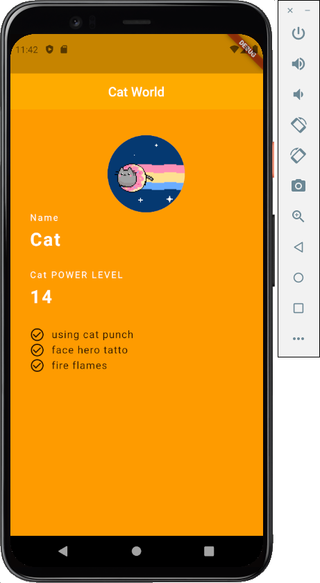

# basic_flutter

A new Flutter project.

## Getting Started

This project is a starting point for a Flutter application.

A few resources to get you started if this is your first Flutter project:

- [Lab: Write your first Flutter app](https://flutter.dev/docs/get-started/codelab)
- [Cookbook: Useful Flutter samples](https://flutter.dev/docs/cookbook)

For help getting started with Flutter, view our
[online documentation](https://flutter.dev/docs), which offers tutorials, samples, guidance on
mobile development, and a full API reference.

## Issue

- [BUG! exception in phase 'semantic analysis'](https://stackoverflow.com/questions/32900912/bug-exception-in-phase-semantic-analysis)

## 기본적인 코딩

- pubspec.yaml
    - pom.xml 또는 build.gradle 과 같은 파일
- ios
    - ios 코드
- android
    - 안드로이드 코드
- lib
    - flutter 코딩은 여기서

> 이미지 추가



## Class and Widget

- 클래스 선언

```dart
class Persion {
  String name;
  int age;
  String sex;
}

// 생성자를 통한 Persion 인스턴스 생성
void main() {
  Person p1 = new Persion();
  p1.age = 30;

  print(p1.age);
}
```

- 클래스와 생성자
    - 생성자와 관련된 함수의 구조와 기능
    - 생성자의 구조와 역할
    - 클래스와 위젯의 관계

```dart
class Persion {
  // 멤버 변수
  String name;
  int age;
  String sex;

  // 생성자 {}로 argument를 감싼다는거는 인자 값이 선택사항으로 바뀐다는 것
  Person({String name, int age, String sex}) {
    this.name = name;
    this.age = age;
    this.sex = sex;
  }
}

void main() {
  // Widget과 매커니즘이 동일한 것을 확인하기 위한 학습 (NamedArgument)
  Person p1 = new Person(name: 'Tom', age: 30, sex: 'male');
  Person p2 = new Person('Jane', 27, 'female');
}
```


## BuildContext 개념

- BuildContext는 stateless 위젯이나 state 빌드 메서드에 의해서 리턴 된 위젯의 부모가 된다.

